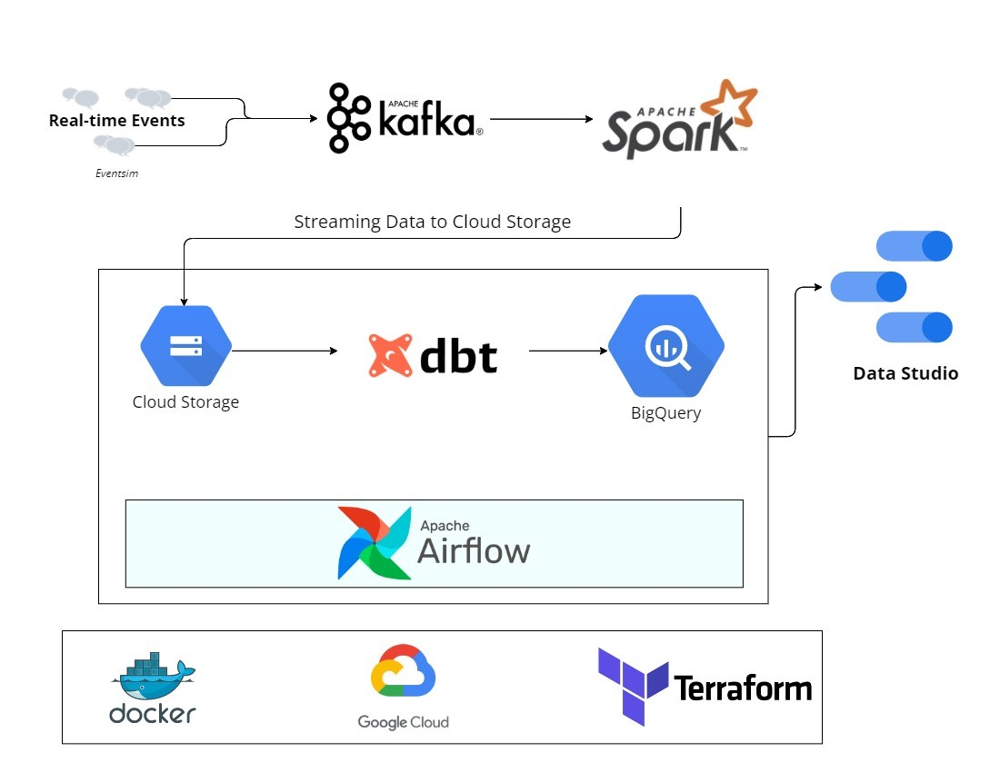

# Musify
An end to end data engineering project made with Kafka, Spark Streaming, dbt, Docker, Airflow, Terraform, GCP and much more!

## Description

### Objective

Events data will be generated using **Eventsim** which will replicate a fake music streaming service (like Spotify), and a data pipeline will be running that consumes this real-time data. Data would be similar to an event of a user listening to a song, navigating on the website, and authenticating. This data would be processed in real-time and stored to a data lake periodically (every two minutes in this case). The hourly batch job will then consume this data, apply transformations, and create the desired tables for our dashboard to generate visualizations. We will try to analyze metrics like popular songs, active users, user demographics etc.

### Dataset

[Eventsim](https://github.com/Interana/eventsim) is a program writeen in Scala that generates event data to replicate page requests for a fake music web site. The results look like real use data, but are fake. The docker image is borrowed from [viirya's fork](https://github.com/viirya/eventsim) of it, as the original project has gone without maintenance for a few years now.

Eventsim uses song data from [Million Songs Dataset](http://millionsongdataset.com) to generate events. I have used a [subset](http://millionsongdataset.com/pages/getting-dataset/#subset) of 10000 songs.

### Tools & Technologies

- Cloud - Google Cloud Platform
- Infrastructure as Code software - Terraform
- Containerization - Docker, Docker Compose
- Stream Processing - Kafka, Spark Streaming
- Language - Python

### Architecture

